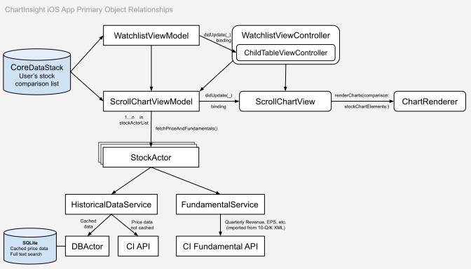

# ChartInsight iPad and iPhone app

[Available on the App Store](https://apps.apple.com/us/app/fundamental-technical-charts/id6451326862)

This app was originally created in 2012 for the first retina iPad and was rewritten from Objective-C to Swift. While most financial apps require cumbersome drop-downs to adjust date ranges, this app supports intuitive zooming and panning. Easily zoom between daily, weekly and monthly charts. The financial data for the app is parsed from XML filings from the Security and Exchange Commission and is provided as-is with no warranty.

## App Structure

WatchlistViewController manages the list of stocks and forwards the result of pinch and pan gestures to the ScrollChartViewModel to scale the chart data. 

Concurrent updates to historical and intraday price data from the HistoricalDataService is handled for each stock by a StockActor for multi core thread safety. StockActors accept GAAP financial data from the FundamentalService and then notify the ScrollChartViewModel via a requestFinished(newPercentChange:) delegate method. 

View to ViewModel binding is implemented with closures. ScrollChartViewModel has a didUpdate: (@MainActor ([ChartElements]) -> Void)? property which ScrollChartView sets to receive notifications when ChartElements are available for rendering. It provides those ChartElements to the ChartRenderer for rendering on the MainActor.

The native app functionality is integrated with a WKWebView of chartinsight.com to allow viewing additional metrics, insider buying and 13-F holdings.

The companion responsive website [chartinsight.com](https://chartinsight.com) was created after the 2012 iOS app and uses a separate axis to compare a fundamental metric (Revenue Per Share, Earnings Per Share, Cash Flow From Ops Per Share) with the stock chart. Dual axis comparison charts work better for single-stock close-only charts but can be confusing when comparing multiple stocks like the iOS app can. For that reason, the iOS app shows the fundamental data above the stock chart.

The original 2012 app also supported searching for news around a date selected on the chart and sharing screenshots. That functionality has been removed to speed up the rewrite to Swift and may be reimplemented later.
